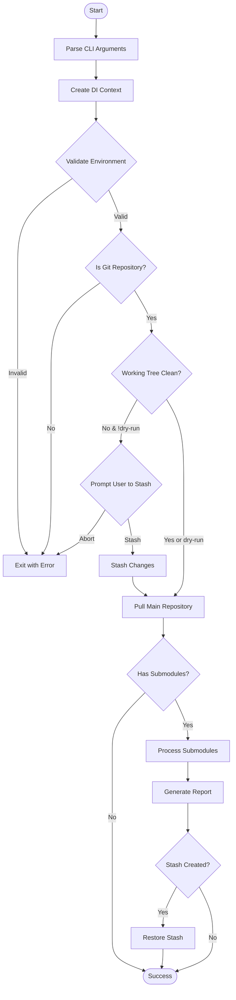

# Implementation Specification: `pull-with-submodules`

## Table of Contents

- [Implementation Specification: `pull-with-submodules`](#implementation-specification-pull-with-submodules)
  - [Table of Contents](#table-of-contents)
  - [1. Overview](#1-overview)
    - [Executive Summary](#executive-summary)
    - [Philosophy \& Design Principles](#philosophy--design-principles)
    - [Architecture Overview](#architecture-overview)
  - [2. Technical Architecture](#2-technical-architecture)
    - [Layered Architecture \& DI Strategy](#layered-architecture--di-strategy)
      - [Context Passing Rules](#context-passing-rules)
      - [Example Implementation](#example-implementation)
    - [Module Responsibilities](#module-responsibilities)
    - [Data Flow](#data-flow)
  - [3. Dependencies \& Integration](#3-dependencies--integration)
    - [@clack/prompts Patterns](#clackprompts-patterns)
    - [simple-git Usage](#simple-git-usage)
    - [Other Dependencies](#other-dependencies)
  - [4. Core Algorithm](#4-core-algorithm)
    - [Main Workflow](#main-workflow)
    - [Submodule Processing](#submodule-processing)
    - [Smart Selection Strategy](#smart-selection-strategy)
  - [5. Implementation Guide](#5-implementation-guide)
    - [Project Setup](#project-setup)
      - [Package Configuration](#package-configuration)
      - [TypeScript Configuration](#typescript-configuration)
    - [Module Specifications](#module-specifications)
      - [Types Definition (types/core.ts)](#types-definition-typescoredts)
      - [Context Factory (context.ts)](#context-factory-contextts)
      - [Core Git Operations (core/git.ts)](#core-git-operations-coregitts)
    - [Error Handling Strategy](#error-handling-strategy)
  - [6. Testing Strategy](#6-testing-strategy)
    - [Test Organization](#test-organization)
    - [Coverage Requirements](#coverage-requirements)
    - [Test Implementation Example](#test-implementation-example)
  - [7. UX/CLI Specification](#7-uxcli-specification)
    - [CLI Options](#cli-options)
    - [Interactive Flows](#interactive-flows)
      - [Standard Execution](#standard-execution)
      - [Uncommitted Changes Flow](#uncommitted-changes-flow)
      - [Error Scenario](#error-scenario)
  - [8. Release Checklist](#8-release-checklist)
    - [Pre-Release Quality Gates](#pre-release-quality-gates)
      - [Code Quality](#code-quality)
      - [Testing](#testing)
      - [Functionality](#functionality)
      - [Documentation](#documentation)
    - [Performance Targets](#performance-targets)
    - [Package Testing](#package-testing)
    - [Platform Compatibility](#platform-compatibility)
    - [Security Checklist](#security-checklist)
  - [Appendix A: Project Structure](#appendix-a-project-structure)
  - [Appendix B: Git Commands Reference](#appendix-b-git-commands-reference)

---

## 1. Overview

### Executive Summary

**Product:** `pull-with-submodules`  
**Version:** 0.1.0  
**Purpose:** Zero-configuration, opinionated Git pull utility for repositories with submodules  
**Philosophy:** Functional core, imperative shell, smart defaults, minimal dependencies

**Key Features:**
- Smart source selection preferring local sibling repositories
- Parallel submodule processing (opt-in)
- Automatic stashing and conflict detection
- Beautiful CLI with interactive prompts
- Dry-run mode for safety
- No configuration files needed

### Philosophy & Design Principles

1. **Functional First**
   - Pure functions for all business logic in `core/`
   - Side effects isolated to orchestration layer
   - Immutable data structures with readonly properties
   - No global state or singletons

2. **Zero Configuration**
   - No config files (`.pullrc`, `pull.config.js`)
   - No environment variables
   - All behavior controlled via CLI flags
   - Opinionated defaults that work for 90% of cases

3. **Fail Safe, Not Silent**
   - Explicit error messages with actionable solutions
   - Dry-run mode for previewing changes
   - Automatic rollback on critical failures
   - Clear user prompts for destructive operations

4. **Code Quality Standards**
   - Max 200 lines per file
   - Max 50 lines per function
   - Max 3 parameters per function
   - Cyclomatic complexity ≤ 10
   - TypeScript strict mode

### Architecture Overview

```
┌─────────────────┐    ┌─────────────────┐    ┌─────────────────┐
│   CLI Layer     │    │   UI Layer      │    │  Context (DI)   │
│                 │    │                 │    │                 │
│ • cli.ts        │    │ • logger.ts     │    │ • createContext │
│ • parsing       │    │ • prompts.ts    │    │ • typed params  │
│ • validation    │    │ • formatters.ts │    │ • no globals    │
└─────────────────┘    └─────────────────┘    └─────────────────┘
         │                       │                       │
         └───────────────────────┼───────────────────────┘
                                 │
                    ┌────────────────────┐
                    │ Orchestration      │
                    │                    │
                    │ • index.ts        │
                    │ • main workflow   │
                    │ • error recovery  │
                    └────────────────────┘
                                 │
         ┌───────────────────────┼───────────────────────┐
         │                       │                       │
┌─────────────────┐    ┌─────────────────┐    ┌─────────────────┐
│   Core Layer    │    │   Lib Layer     │    │   Types Layer   │
│                 │    │                 │    │                 │
│ • git.ts        │    │ • async.ts      │    │ • git.ts      │
│ • submodules.ts │    │ • fs.ts         │    │ • core.ts     │
│ • strategies.ts │    │ • errors.ts     │    │ • readonly      │
│ • siblings.ts   │    │ • git-utils.ts  │    │   interfaces    │
│ • gitlink.ts    │    │                 │    │                 │
│ • pure funcs    │    │ • utilities     │    │                 │
└─────────────────┘    └─────────────────┘    └─────────────────┘
```

## 2. Technical Architecture

### Layered Architecture & DI Strategy

To avoid argument drilling while maintaining testability, we use a **hybrid approach**:

#### Context Passing Rules

1. **Full Context** - Pass entire context when:
   - Function uses 3+ fields from context
   - At layer boundaries (orchestration → core)
   - Creating specialized operations

2. **Individual Parameters** - Pass specific params when:
   - Function uses 1-2 fields only
   - Pure functions in core layer
   - Explicit dependencies needed

3. **Factory Pattern** - Use factories when:
   - Set of operations share context
   - Avoiding repetitive parameter passing
   - Creating closures over common state

#### Example Implementation

```typescript
// Orchestration - receives full context
export async function processRepository(context: ExecutionContext) {
  const submodules = await parseGitmodules(context.repositoryRoot);
  
  // Create specialized function with partial application
  const processOne = (sub: Submodule) => 
    processSubmodule(sub, {
      dryRun: context.dryRun,
      forceRemote: context.forceRemote,
      repoRoot: context.repositoryRoot
    });
  
  return context.parallel 
    ? runInBatches(submodules, processOne, 4)
    : runSequential(submodules, processOne);
}

// Core - pure function with minimal params
export function selectCommitSmart(
  localSha: string | null,
  remoteSha: string | null,
  forceRemote: boolean  // only what's needed
): CommitSelection | null {
  // pure logic, no context
}

// Factory for stateful operations
export function createGitOperations(context: Pick<ExecutionContext, 'dryRun' | 'verbose'>) {
  return {
    async commit(message: string): Promise<void> {
      if (context.dryRun) {
        log('DRY-RUN: would commit', message);
        return;
      }
      // actual implementation
    }
  };
}
```

### Module Responsibilities

| Module | Responsibility | Dependencies | State |
|--------|---------------|--------------|-------|
| **core/git** | Git command primitives | simple-git | Stateless |
| **core/submodules** | Submodule business logic | core/git | Stateless |
| **core/strategies** | Commit selection logic | None | Stateless |
| **core/siblings** | Local repo discovery | lib/fs | Stateless |
| **core/gitlink** | Gitlink operations | core/git | Stateless |
| **lib/async** | Retry, timeout, parallel | p-limit | Stateless |
| **lib/fs** | File system utilities | node:fs | Stateless |
| **lib/errors** | Custom error classes | None | Stateless |
| **ui/logger** | Console output | None | Stateless |
| **ui/prompts** | User interaction | @clack/prompts | Stateless |
| **cli** | Argument parsing | cac | Stateless |
| **index** | Main orchestration | All above | Stateless |

### Data Flow

```
CLI Input ──parse──▶ Context (DI)
                         │
                         ▼
                   Orchestrator ──▶ Core (pure) ──▶ Git (simple-git)
                         │              ▲
                         ▼              │
                    UI/Logger      FS/Async utils
```

## 3. Dependencies & Integration

### @clack/prompts Patterns

Interactive UI components following Clack design patterns:

```typescript
import * as p from '@clack/prompts';

// Session lifecycle
p.intro('pull-with-submodules v0.1.0');
// ... operations ...
p.outro('✨ Done in 4.9s');

// User cancellation handling
const answer = await p.confirm({ 
  message: 'Stash uncommitted changes?' 
});
if (p.isCancel(answer)) {
  p.cancel('Operation cancelled');
  process.exit(0);
}

// Progress indication
const s = p.spinner();
s.start('Fetching origin...');
await git.fetch();
s.stop('Fetch completed');

// Grouped prompts with cancellation
const options = await p.group(
  {
    parallel: () => p.confirm({ message: 'Process in parallel?' }),
    verbose: () => p.confirm({ message: 'Enable verbose output?' })
  },
  { 
    onCancel: () => { 
      p.cancel('Cancelled'); 
      process.exit(0); 
    } 
  }
);

// Logging
import { log } from '@clack/prompts';
log.step('Processing submodules');
log.success('Updated 3 submodules');
log.warn('Detached HEAD fallback');
log.error('Rebase conflict detected');
```

### simple-git Usage

All Git operations standardized through simple-git:

```typescript
import { simpleGit, SimpleGit } from 'simple-git';

// Factory with consistent configuration
export function createGit(baseDir: string): SimpleGit {
  return simpleGit({
    baseDir,
    binary: 'git',
    maxConcurrentProcesses: 6,  // For all Git operations
    timeout: { block: 30000 }
  });
}

// Standard operations
const git = createGit(repoPath);
await git.fetch(['--prune', 'origin']);
await git.pull(['--rebase']);
await git.status(['--porcelain']);
await git.stash(['push', '-m', 'auto-stash']);

// Submodule operations via raw
await git.raw(['submodule', 'sync', '--', path]);
await git.raw(['submodule', 'update', '--init', '--', path]);
await git.raw(['symbolic-ref', 'refs/remotes/origin/HEAD']);
```

### Other Dependencies

| Package | Purpose | Configuration |
|---------|---------|---------------|
| **cac** | CLI parsing | Handles flags, help, version |
| **p-limit** | Concurrency control | Max 4 parallel submodules |
| **node:test** | Testing framework | Via tsx --test runner |
| **tsx** | TypeScript execution | For tests and development |

**Concurrency Limits:**
- simple-git: `maxConcurrentProcesses: 6` (Git operations)
- p-limit: `max: 4` (parallel submodule processing)

## 4. Core Algorithm

### Main Workflow



### Submodule Processing

For each submodule:

1. **Initialize & Sync**
   ```bash
   git submodule sync -- <path>
   git submodule update --init -- <path>
   ```

2. **Determine Tracking Branch**
   - Priority: `.gitmodules` → `origin/HEAD` → `main`

3. **Fetch Commits**
   - Remote: `git fetch origin && git rev-parse origin/<branch>`
   - Local: Check `../<repo-name>` and `../<basename>`

4. **Select Target Commit** (Smart Strategy)
   ```typescript
   if (forceRemote) return remoteSha;
   if (both exist) {
     if (isAncestor(remoteSha, localSha)) return localSha;
     else return remoteSha;  // Safer choice
   }
   return available SHA or skip;
   ```

5. **Update Working Tree**
   - Try: `git checkout <branch> && git merge --ff-only <sha>`
   - Fallback: `git checkout --detach <sha>`

6. **Commit Gitlink** (if changes & not --no-commit)
   ```bash
   git add <submodule-path>
   git commit -m "chore(submodule): bump <path> to <branch> @ <sha>"
   ```

### Smart Selection Strategy

```typescript
export function selectCommitSmart(
  localSha: string | null,
  remoteSha: string | null,
  forceRemote: boolean
): CommitSelection | null {
  // Force remote takes precedence
  if (forceRemote && remoteSha) {
    return { sha: remoteSha, source: 'remote', reason: 'forced' };
  }
  
  // Both exist - check ancestry
  if (localSha && remoteSha) {
    // Local is ahead - use it
    if (isAncestor(remoteSha, localSha)) {
      return { sha: localSha, source: 'local', reason: 'contains remote' };
    }
    // Diverged or remote ahead - use remote (safer)
    return { sha: remoteSha, source: 'remote', reason: 'diverged histories' };
  }
  
  // Use what's available
  if (localSha) return { sha: localSha, source: 'local', reason: 'only local' };
  if (remoteSha) return { sha: remoteSha, source: 'remote', reason: 'only remote' };
  
  return null;  // Skip if neither available
}
```

## 5. Implementation Guide

### Project Setup

#### Package Configuration
See @package.json

#### TypeScript Configuration
See @tsconfig.json

### Module Specifications

#### Types Definition (types/core.ts)
```typescript
export interface ExecutionContext {
  readonly dryRun: boolean;
  readonly noCommit: boolean;
  readonly forceRemote: boolean;
  readonly parallel: boolean;
  readonly verbose: boolean;
  readonly repositoryRoot: string;
}

export interface Submodule {
  readonly name: string;
  readonly path: string;
  readonly url: string;
  readonly branch?: string;
}

export interface UpdateResult {
  readonly submodule: Submodule;
  readonly updated: boolean;
  readonly targetSha?: string;
  readonly source?: 'local' | 'remote' | 'skipped';
  readonly error?: Error;
  readonly duration: number;
}

export interface CommitSelection {
  readonly sha: string;
  readonly source: 'local' | 'remote';
  readonly reason: string;
}
```

#### Context Factory (context.ts)
```typescript
import type { ExecutionContext } from './types/core.js';
import type { CliOptions } from './cli.js';

export function createContext(
  options: CliOptions, 
  repositoryRoot: string
): ExecutionContext {
  return {
    dryRun: options.dryRun,
    noCommit: options.noCommit,
    forceRemote: options.forceRemote,
    parallel: options.parallel,
    verbose: options.verbose,
    repositoryRoot
  };
}
```

#### Core Git Operations (core/git.ts)
```typescript
import { simpleGit, SimpleGit } from 'simple-git';
import { GitOperationError } from '../lib/errors.js';

const GIT_TIMEOUT = 30000;

export function createGit(baseDir: string): SimpleGit {
  return simpleGit({
    baseDir,
    binary: 'git',
    maxConcurrentProcesses: 6,
    timeout: { block: GIT_TIMEOUT }
  });
}

export async function pullWithRebase(repoPath: string): Promise<void> {
  const git = createGit(repoPath);
  
  try {
    await git.pull(['--rebase']);
  } catch (error) {
    const status = await git.status();
    if (status.conflicted.length > 0) {
      await git.rebase(['--abort']);
      throw new GitOperationError(
        'pull --rebase',
        repoPath,
        1,
        error as Error
      );
    }
    throw error;
  }
}
```

### Error Handling Strategy

Unified error handling approach:

| Operation Type | Strategy | Recovery |
|---------------|----------|----------|
| **Environment validation** | Fail fast | Exit with instructions |
| **Main repository operations** | Fail fast | Rollback and exit |
| **Submodule operations** | Continue and report | Collect errors, show in summary |
| **Network errors** | Retry with backoff | 3 attempts with exponential delay |
| **User cancellation** | Immediate exit | Clean exit code 0 |
| **Catastrophic failure** | Full rollback | Restore stash, cleanup, exit 1 |

```typescript
// lib/errors.ts
export class GitOperationError extends Error {
  constructor(
    public readonly operation: string,
    public readonly path: string,
    public readonly exitCode: number,
    public readonly cause?: Error
  ) {
    super(`Git operation '${operation}' failed at ${path}`);
    this.name = 'GitOperationError';
  }
}

export class NetworkError extends Error {
  constructor(
    public readonly url: string,
    public readonly attempt: number,
    public readonly cause?: Error
  ) {
    super(`Network request to ${url} failed (attempt ${attempt}/3)`);
    this.name = 'NetworkError';
  }
}
```

## 6. Testing Strategy

### Test Organization

**Unit Tests (Co-located):**
- Location: `.spec.ts` files next to source files
- Example: `core/git.ts` → `core/git.spec.ts`
- Benefits: Better discoverability, easier refactoring, clear ownership
- Runner: `tsx --test src/**/*.spec.ts`

**Integration Tests:**
- Not implemented in v0.1.0 (focusing on unit tests first)
- Future location: `tests/` directory with `.test.ts` extension

### Coverage Requirements

| Module Type | Minimum Coverage | Priority |
|------------|------------------|----------|
| **Overall** | 70% | Required |
| **Core modules** | 80% | Required |
| **Utilities** | 90% | Required |
| **Critical paths** | 100% | Required |
| **UI modules** | 60% | Nice to have |

### Test Implementation Example

```typescript
// core/strategies.spec.ts (co-located with strategies.ts)
import { test } from 'node:test';
import assert from 'node:assert/strict';
import { selectCommitSmart } from './strategies.js';

test('selectCommitSmart', async (t) => {
  await t.test('prefers local when it contains remote', () => {
    const result = selectCommitSmart('local123', 'remote456', false);
    assert.equal(result?.source, 'local');
    assert.equal(result?.reason, 'contains remote');
  });
  
  await t.test('respects force-remote flag', () => {
    const result = selectCommitSmart('local123', 'remote456', true);
    assert.equal(result?.source, 'remote');
    assert.equal(result?.reason, 'forced');
  });
  
  await t.test('returns null when no commits available', () => {
    const result = selectCommitSmart(null, null, false);
    assert.equal(result, null);
  });
});
```

## 7. UX/CLI Specification

### CLI Options

| Flag | Alias | Description | Default |
|------|-------|-------------|---------|
| `--dry-run` | `-d` | Preview changes without applying | false |
| `--no-commit` | `-n` | Skip auto-commit of gitlinks | false |
| `--force-remote` | `-r` | Always prefer remote sources | false |
| `--parallel` | `-p` | Process submodules in parallel | false |
| `--verbose` | `-v` | Show detailed debug output | false |
| `--help` | `-h` | Show help message | - |
| `--version` | | Show version number | - |

### Interactive Flows

#### Standard Execution
```
┌─────────────────────────────────────────────────────────────────┐
│                    pull-with-submodules v0.1.0                   │
└─────────────────────────────────────────────────────────────────┘

◇  Validating environment
│  ✔ Git 2.44.0
│  ✔ Node 22.6.0
│  ✔ Repository: /Users/alex/work/monorepo
│
◆  Working tree status
│  Clean ✔
│
◇  Pulling main repository (--rebase)
│  Fetching origin... done
│  Fast-forward: 3 new commits
│
◆  Processing 5 submodules
│
├─ [1/5] auth-service ✔ Updated to local @ 6ffa2b31
├─ [2/5] shared-utils ✔ Updated to remote @ abc12345
├─ [3/5] ui-components ○ Already up-to-date
├─ [4/5] docs-site ○ No changes needed
└─ [5/5] config-store ✔ Updated to remote @ 789abcde

╭─────────────────────── Summary ───────────────────────╮
│  Total:    5 submodules                               │
│  Updated:  3 (auth-service, shared-utils, config)     │
│  Skipped:  2 (ui-components, docs-site)               │
│  Failed:   0                                          │
│  Time:     4.9s                                       │
╰────────────────────────────────────────────────────────╯

◆  Gitlink commits created:
│  • chore(submodule): bump services/auth to main @ 6ffa2b31
│  • chore(submodule): bump packages/utils to main @ abc12345
│
└  ✨ Done in 4.9s
```

#### Uncommitted Changes Flow
```
◆  Working tree status
│  ⚠ Uncommitted changes detected:
│    M src/index.js
│    ? temp.log
│
◆  Stash and continue?
│  ● Yes, stash my changes
│  ○ No, abort
│
◇  Stashing changes...
│  Created stash: stash@{0}
```

#### Error Scenario
```
◇  Pulling main repository (--rebase)
│  ✗ Rebase conflicts detected!
│
╭──────────────── ⚠ Rebase Failed ─────────────────╮
│  Conflicts detected in:                          │
│    • src/config.js                               │
│    • package.json                                │
│                                                   │
│  To resolve manually:                            │
│    1. git pull --rebase                          │
│    2. Fix conflicts                              │
│    3. git add <files>                            │
│    4. git rebase --continue                      │
│    5. Run pull-with-submodules again             │
╰───────────────────────────────────────────────────╯

└  ✗ Failed: Manual conflict resolution required
```

## 8. Release Checklist

### Pre-Release Quality Gates

#### Code Quality
- [ ] ESLint: Zero errors/warnings
- [ ] TypeScript: Strict mode passes
- [ ] All functions ≤ 50 lines
- [ ] All files ≤ 200 lines
- [ ] Cyclomatic complexity ≤ 10

#### Testing
- [ ] Unit test coverage ≥ 70% overall
- [ ] Core modules ≥ 80% coverage
- [ ] Utilities ≥ 90% coverage
- [ ] All tests passing with `tsx --test`

#### Functionality
- [ ] All CLI flags work correctly
- [ ] Dry-run mode accurate
- [ ] Stash/restore working
- [ ] Parallel mode stable
- [ ] Error messages actionable

#### Documentation
- [ ] README accurate and complete
- [ ] CLI help text comprehensive
- [ ] Code comments for complex logic
- [ ] Examples working

### Performance Targets

| Metric | Target | Maximum |
|--------|--------|---------|
| Single submodule | < 2s | 5s |
| 5 submodules (sequential) | < 10s | 15s |
| 5 submodules (parallel) | < 5s | 8s |
| Memory usage (20 submodules) | < 100MB | 150MB |

### Package Testing

- [ ] `npm pack` creates valid package
- [ ] `npm install -g` works correctly
- [ ] `npx pull-with-submodules` executes
- [ ] Works on Node 22+
- [ ] ESM imports resolve correctly
- [ ] Binary shebang correct

### Platform Compatibility

- [ ] macOS (Intel & ARM)
- [ ] Linux (Ubuntu 20.04+)
- [ ] Windows (Git Bash)
- [ ] Git 2.13+

### Security Checklist

- [ ] No sensitive data in logs
- [ ] Safe command construction (no injection)
- [ ] Proper error sanitization
- [ ] Dependencies up to date
- [ ] No unnecessary permissions

---

## Appendix A: Project Structure

```
pull-with-submodules/
├── bin/
│   └── pull.js                     # #!/usr/bin/env node entry
├── dist/                           # [generated] TypeScript output
├── src/
│   ├── index.ts                    # Main orchestration
│   ├── index.spec.ts               # Co-located test
│   ├── cli.ts                      # CLI argument parsing
│   ├── cli.spec.ts                 # Co-located test
│   ├── context.ts                  # DI context factory
│   ├── context.spec.ts             # Co-located test
│   ├── core/
│   │   ├── git.ts                  # Git operations via simple-git
│   │   ├── git.spec.ts             # Co-located test
│   │   ├── submodules.ts           # Submodule logic
│   │   ├── submodules.spec.ts      # Co-located test
│   │   ├── strategies.ts           # Commit selection
│   │   ├── strategies.spec.ts      # Co-located test
│   │   ├── siblings.ts             # Local repo discovery
│   │   ├── siblings.spec.ts        # Co-located test
│   │   ├── gitlink.ts              # Gitlink commits
│   │   └── gitlink.spec.ts         # Co-located test
│   ├── lib/
│   │   ├── async.ts                # Retry, timeout, parallel
│   │   ├── async.spec.ts           # Co-located test
│   │   ├── fs.ts                   # File system utils
│   │   ├── fs.spec.ts              # Co-located test
│   │   ├── errors.ts               # Custom error classes
│   │   ├── errors.spec.ts          # Co-located test
│   │   ├── git-utils.ts            # Git helpers
│   │   └── git-utils.spec.ts       # Co-located test
│   ├── ui/
│   │   ├── logger.ts               # Console output
│   │   ├── logger.spec.ts          # Co-located test
│   │   ├── prompts.ts              # @clack/prompts wrapper
│   │   ├── prompts.spec.ts         # Co-located test
│   │   ├── formatters.ts           # Output formatting
│   │   └── formatters.spec.ts      # Co-located test
│   └── types/
│       ├── git.ts                # Git-related types
│       └── core.ts               # Core domain types
├── .eslintrc.json
├── .prettierrc.json
├── .gitignore
├── .npmignore
├── tsconfig.json
├── package.json
├── package-lock.json
├── LICENSE
├── CHANGELOG.md
└── README.md
```

## Appendix B: Git Commands Reference

| Operation | Command | simple-git API |
|-----------|---------|----------------|
| Fetch with prune | `git fetch --prune origin` | `git.fetch(['--prune', 'origin'])` |
| Pull with rebase | `git pull --rebase` | `git.pull(['--rebase'])` |
| Check status | `git status --porcelain` | `git.status(['--porcelain'])` |
| Stash changes | `git stash push -m "msg"` | `git.stash(['push', '-m', msg])` |
| Submodule sync | `git submodule sync -- path` | `git.raw(['submodule', 'sync', '--', path])` |
| Submodule update | `git submodule update --init -- path` | `git.raw(['submodule', 'update', '--init', '--', path])` |
| Get remote HEAD | `git symbolic-ref refs/remotes/origin/HEAD` | `git.raw(['symbolic-ref', 'refs/remotes/origin/HEAD'])` |
| Check ancestry | `git merge-base --is-ancestor A B` | `git.raw(['merge-base', '--is-ancestor', A, B])` |

---

*End of Specification*
